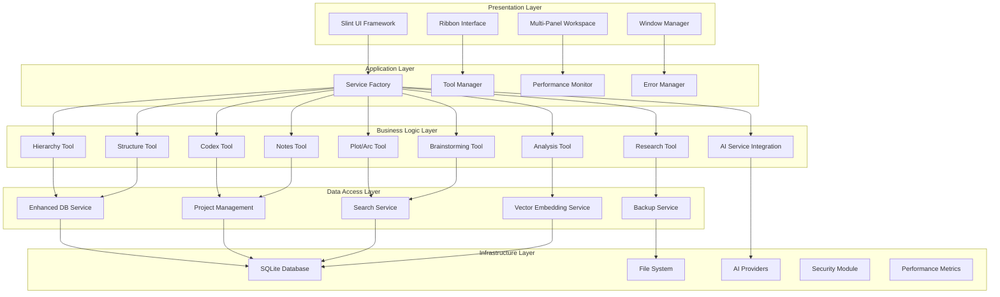
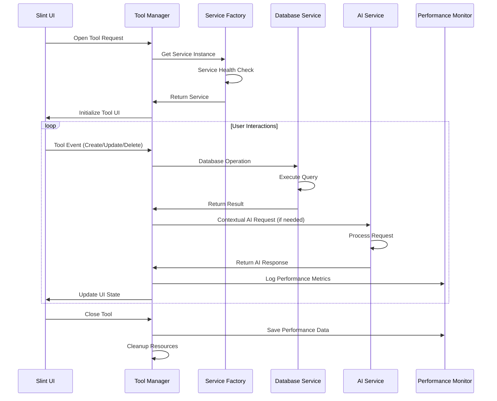
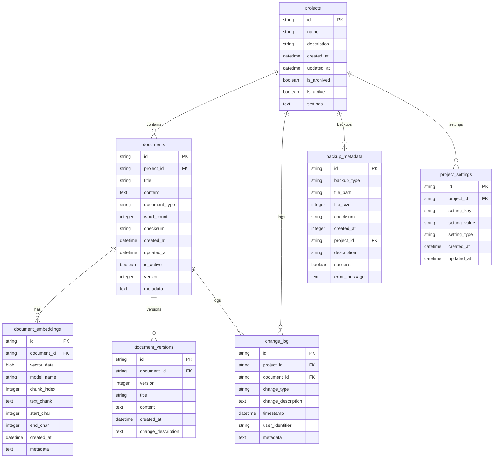
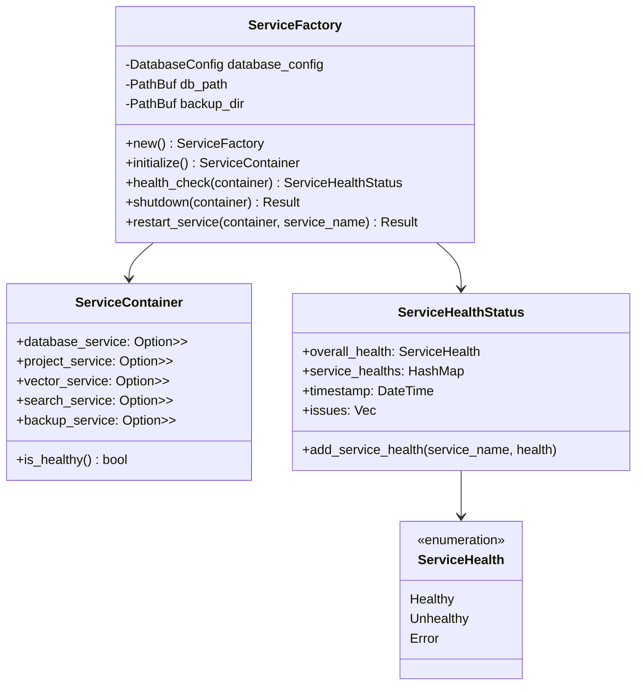
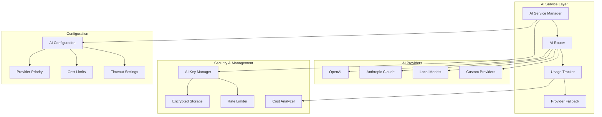
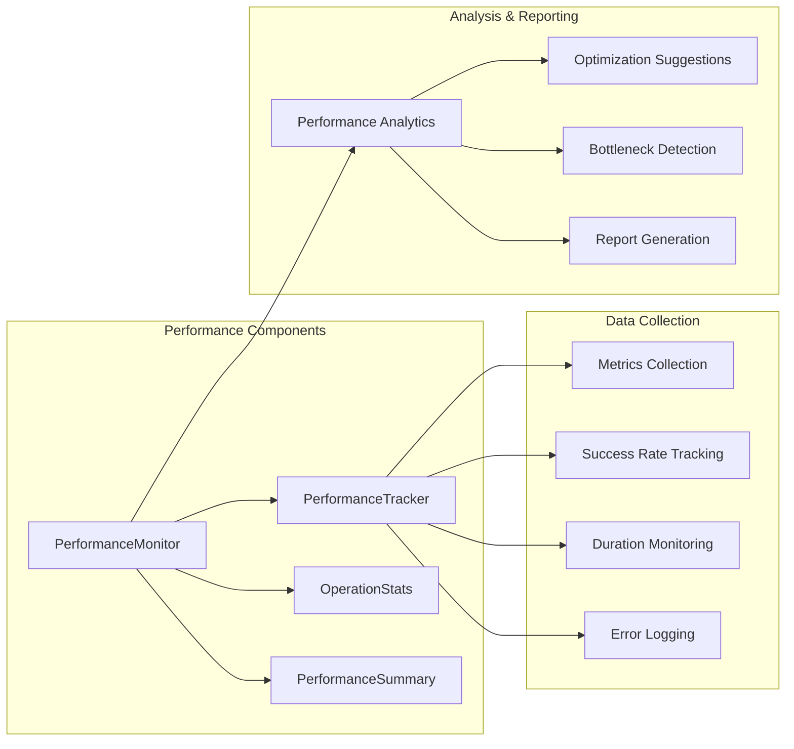
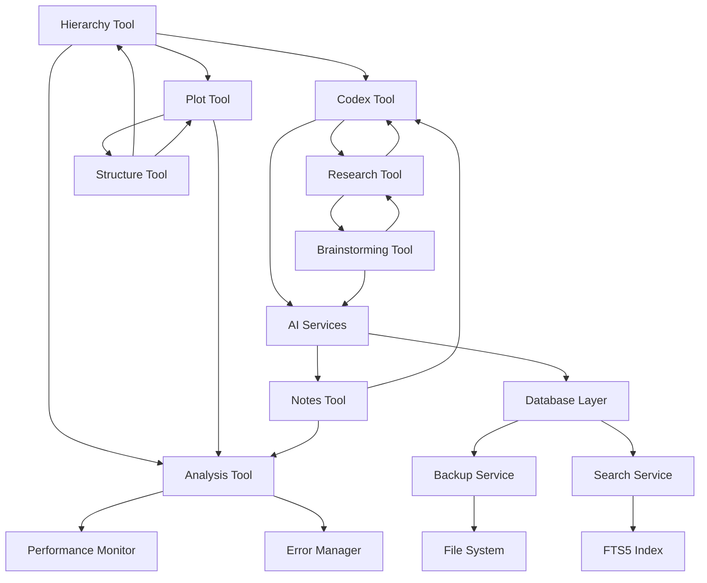
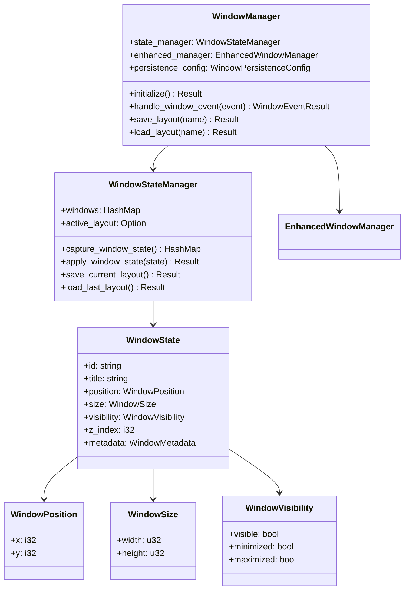
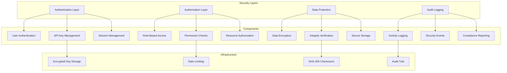
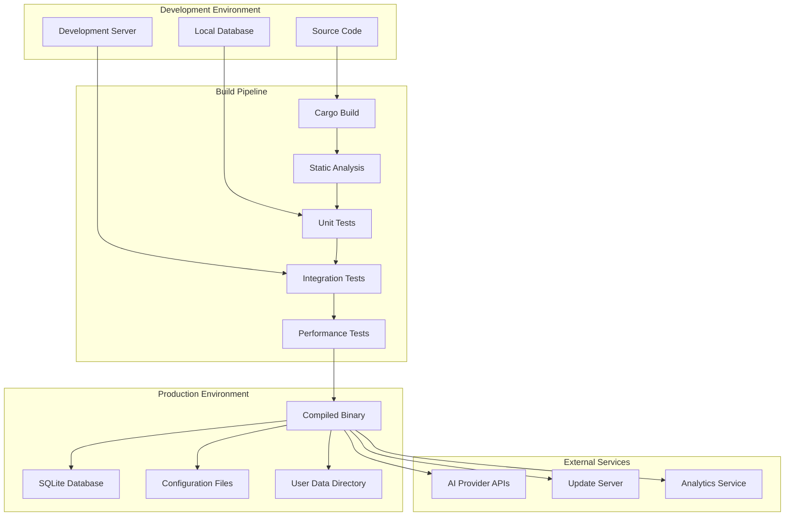

# Herding Cats Rust - Architecture Diagrams

## System Overview Diagram



## Tool Integration Flow Diagram



## Database Schema Diagram



## Service Factory Pattern Diagram



## Tool Registry System Diagram

```mermaid
classDiagram
    class ToolManager {
        +registry: ToolRegistry
        +event_handlers: Vec<Box<dyn ToolEventHandler>>
        +initialize_tools() Result
        +register_event_handler(handler)
        +broadcast_event(event) Result
    }
    
    class ToolRegistry {
        -tool_states: HashMap<ToolType, ToolWindowState>
        +register_tool(tool_type)
        +set_tool_state(tool_type, state)
        +get_tool_state(tool_type) Option
        +open_tool(tool_type)
        +close_tool(tool_type)
        +is_tool_open(tool_type) bool
    }
    
    class ToolWindowState {
        +is_open: bool
        +position: (i32, i32)
        +size: (u32, u32)
        +z_index: i32
    }
    
    class ToolEvent {
        <<enumeration>>
        ToolOpened(ToolType)
        ToolClosed(ToolType)
        ToolFocused(ToolType)
        DataChanged{tool, data}
        DragStarted{tool, data}
        DragCompleted{tool, target_tool, data}
    }
    
    class ToolType {
        <<enumeration>>
        Hierarchy
        Codex
        Notes
        Research
        Plot
        Analysis
        Structure
        Brainstorming
    }
    
    ToolManager --> ToolRegistry
    ToolManager --> ToolEvent
    ToolRegistry --> ToolWindowState
    ToolRegistry --> ToolType
```

## AI Service Architecture Diagram



## Performance Monitoring Architecture



## Cross-Tool Data Flow Diagram



## Window Management Architecture



## Security Architecture Diagram



## Component Interaction Matrix

| Component | Hierarchy | Codex | Plot | Research | Analysis | Structure | Brainstorming | Notes |
|-----------|-----------|-------|------|----------|----------|-----------|---------------|-------|
| **Database** | ✓ | ✓ | ✓ | ✓ | ✓ | ✓ | ✓ | ✓ |
| **AI Services** | ✓ | ✓ | ✓ | ✓ | ✓ | ✓ | ✓ | ✓ |
| **Search** | ✓ | ✓ | ✓ | ✓ | ✓ | ✓ | ✓ | ✓ |
| **Backup** | ✓ | ✓ | ✓ | ✓ | ✓ | ✓ | ✓ | ✓ |
| **Performance** | ✓ | ✓ | ✓ | ✓ | ✓ | ✓ | ✓ | ✓ |
| **Error Handling** | ✓ | ✓ | ✓ | ✓ | ✓ | ✓ | ✓ | ✓ |

## Deployment Architecture



These architecture diagrams provide a comprehensive visual representation of the Herding Cats Rust application's structure, showing the relationships between components, data flow patterns, and integration points across the entire system.